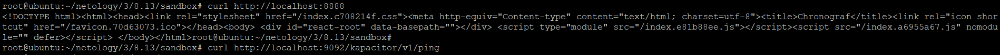
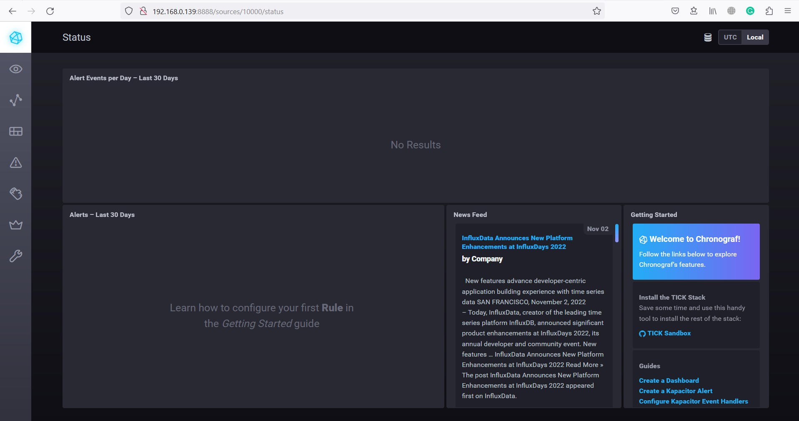
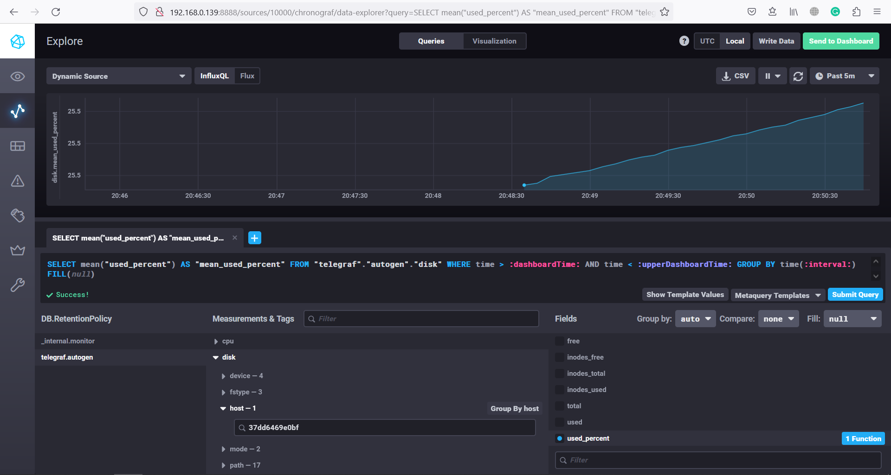
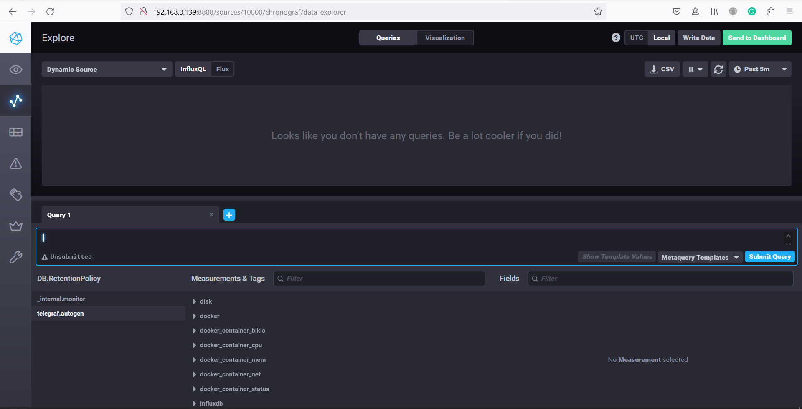

1. Я бы предложил вывести нагрузку на сеть на данном устройстве: Входящую и исходящую на текущий момент и статистику за последние сутки.  
   Вывести нагрузку на ЦП: текущую и статистику за последние сутки.  
   Посколько отчёты сохраняются на диск, то будет не лишним мониторить и его. Предложил бы вывести показатель свободного пространства, скорость чтения/записи и IOWait к диску.
2. В качестве показателей можно предложить что мы должны отдавать клиенту не более 5% 4xx и 5xx ответов, а также должны отвечать не дольше 3-х секунд.  
   Для этого будет необходимо собирать с серверов такие метрики как коды ответов и скорость ответа, а потом исходя из статистики за определенный промежуток времени подсчитывать показатели. Например для кодов ответов: (Количество 4хх ответов + количество 5xx ответов) / (Общее кол-во ответов).
3. Можно воспользоваться бесплатными облачными сервисами хранения метрик, например ElasticSearch.
4. Стоит отслеживать не 2хх коды, а наоборот коды ошибок 4хх и 5хх и сопоставлять их количество с общим числом ответов.
5. Плюсы и минусы систем:
   Система | плюсы | минусы
   ------- | ----- | ------
   push | Проще отправлять данные в различные системы мониторинга, за счёт этого можно организовать дублируемость данных без настройки репликации между серверами. Возможность более гибко настраивать собираемые метрики на каждом отдельном сервере. | Придётся устанавливать и настраивать каждый агент отдельно.
   pull | Возможность централизованной настройки агентов, можно контроллировать от каких хостов получать данные, а от каких нет. | Более централизованный подход к управлению лишает гибкости в настройках каждого отдельного агента. Репликацию данных, в случае нескольких управляющих узлов необходимо обеспечивать на уровне самих узлов.
6. ПО | Тип системы
   -- | -----------
   Prometheus | pull
   TICK | push
   Zabbix | pull/push
   VictoriaMetrics | push
   Nagios | pull

7. Скриншот команд:  
     
   Скриншот интерфейса ПО chronograf:  
   
8. Пришлось отредактировать файл конфигурации telegraf т.к. по умолчанию в том что поставляется с репозиторием показатели ОЗУ и диска не собираются.  
   Скриншот отображения параметров диска:  
   
9. Скришот со список measurements после добавления docker:  
   